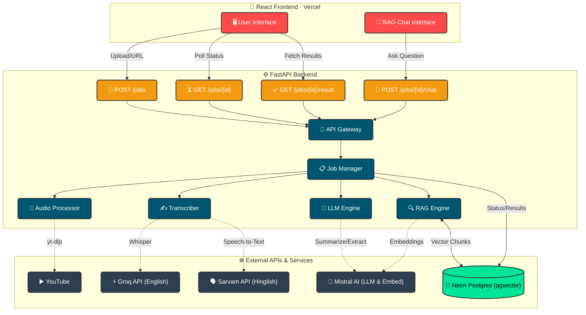

<div align="center">

# 🎬 AI Video Assistant

**Transform your audio, video, and YouTube links into actionable insights with the power of LLMs & RAG.**

[](https://fastapi.tiangolo.com/)
[](https://react.dev/)
[](https://vercel.com/)
[](https://mistral.ai/)
[](https://neon.tech/)

</div>

AI Video Assistant is an intelligent pipeline that takes a YouTube URL or an uploaded audio/video file, transcribes it, generates summaries, extracts actionable items, and provides a RAG (Retrieval-Augmented Generation) chat interface to converse with the transcript.
The system is designed with a microservices architecture, separating a robust FastAPI backend from a React (Vite) frontend deployed on Vercel.

---

## 🏗️ Architecture Flow



---

## ✨ Features

- **Multi-Source Input:** Process public YouTube videos or directly upload audio/video files.
- **Dual-Language Transcription:** Support for English (via Groq Whisper) and Hinglish (via Sarvam AI).
- **Automated Insights:** Automatically generates a suitable title, comprehensive summary, action items, key decisions, and open questions.
- **Interactive RAG Chat:** Chat directly with the context of your meeting/video using Mistral AI.
- **Isolated Jobs:** Every job receives isolated processing and isolated vector storage to prevent context contamination.

---

## 🛠️ Technology Stack

### Backend
- **Framework:** FastAPI, Uvicorn
- **Audio Processing:** yt-dlp, ffmpeg (single streaming pass decodes + chunks at flat memory, so long files fit the 512MB free tier), pydub
- **AI/LLM:** LangChain LCEL, Mistral AI (LLM & Embeddings), Groq (STT), Sarvam (STT)
- **Database & Vectors:** Neon (Serverless Postgres), pgvector, SQLAlchemy

### Frontend
- **Framework:** React 18 + Vite (static SPA)
- **Hosting:** Vercel
- **Backend calls:** `fetch` to the FastAPI service; dev uses a Vite proxy so local development works without a CORS change

---

## ⚙️ Prerequisites

Before you start, make sure you have the following API keys and services available:
1. **Mistral API Key** - For embeddings and chat generation.
2. **Groq API Key** - For lightning-fast English transcription (using Whisper).
3. **Sarvam API Key** - For Hinglish speech-to-text.
4. **Neon Postgres Database** - A connection string (`DATABASE_URL`) to a database with the `pgvector` extension enabled.

*Note: For the backend to process audio, `ffmpeg` must be installed on your system. Docker handles this natively.*

---

## 🚀 Setup & Installation

### 1. Environment Configuration

Copy the example environment file and fill in your actual credentials.
**Never commit your `.env` file to version control.**

```bash
cp .env.example .env
```

Ensure `.env` contains:
- `MISTRAL_API_KEY`
- `GROQ_API_KEY`
- `SARVAM_API_KEY`
- `DATABASE_URL`
- `FRONTEND_ORIGIN` (Optional for local dev, needed for production CORS)
- `YT_DLP_COOKIES_PATH` (Optional, path to cookies to mitigate YouTube rate-limiting)
- `MAX_UPLOAD_MB` (Optional, default `200` — uploads over this get a clean `413`)
- `HF_TOKEN` (Optional — silences the "unauthenticated requests to the HF Hub" warning from the embeddings tokenizer download)
- `ADMIN_TOKEN` (Optional — enables the token-gated `/admin/cleanup` endpoint; unset means the endpoint stays disabled)

### 2. Backend Setup (Docker recommended)

The easiest way to run the backend locally with all system dependencies (like `ffmpeg`) is using Docker.

```bash
# Build the Docker image
docker build -t ai-video-backend .

# Run the container (reads from your .env file)
docker run -p 8000:8000 --env-file .env ai-video-backend
```

*Alternatively, run natively (from the repo root — the backend is a package, so
`backend.api` is the correct import path):*
```bash
pip install -r backend/requirements.txt
# Ensure ffmpeg is installed via your OS package manager (e.g. brew install ffmpeg)
uvicorn backend.api:app --host 0.0.0.0 --port 8000 --reload
```

### 3. Frontend Setup

In a separate terminal, install and run the React frontend.

```bash
cd web
npm install
npm run dev
```

The dev server runs at `http://localhost:5173`. It proxies API calls to the
backend and, by default, targets the deployed Render backend — so it works out
of the box. To point it at a different backend (e.g. a local one at
`http://localhost:8000`), set `VITE_BACKEND_URL` in `web/.env` (see
`web/.env.example`). The Vite dev proxy routes browser requests through the dev
server, so local development never trips the backend's CORS allow-list.

---

## ☁️ Deployment Strategy

This architecture is optimized for free-tier cloud deployment:

- **Backend:** Deploy the FastAPI app using the provided `Dockerfile` to a service like **Render** or Railway. The long-running nature of processing videos utilizes asynchronous background tasks to prevent HTTP timeouts.
- **Frontend:** Deploy the `web/` React app to **Vercel** — import the repo, set **Root Directory** to `web` (framework auto-detects as Vite), and add **`VITE_BACKEND_URL`** = the backend URL. Then add the resulting Vercel origin to the backend's `FRONTEND_ORIGIN` (comma-separated, **no trailing slash**) so CORS admits it.
- **Database:** **Neon** Serverless Postgres perfectly handles the relational states and vector storage via `pgvector`.
- **Scheduled cleanup:** A GitHub Actions workflow (`.github/workflows/cleanup.yml`) calls `POST /admin/cleanup?older_than_days=15` daily to purge old jobs and their vector collections. It authenticates with an `ADMIN_TOKEN` repo secret that must match the backend's `ADMIN_TOKEN` env var. Set both to the same value; adjust the retention window or `cron` schedule in the workflow as needed.

---

## 🗑️ Data Lifecycle

Transcripts, summaries, findings, and vectors for a job live in Neon only until the job is released. A job is deleted (`DELETE /jobs/{id}` → job row + its `pgvector` collection) in three ways:

- **New session / reset** in the UI.
- **Tab close or refresh** — a `pagehide` handler fires a `keepalive` `DELETE` so a session never orphans its data.
- **The scheduled cron** (above), which sweeps anything older than 15 days that slipped through — e.g. a browser killed before the unload request flushed.

To purge on demand, call the endpoint directly (never commit the token or paste it in chat):

```bash
curl -X POST "https://<backend-url>/admin/cleanup?older_than_days=15" \
  -H "X-Admin-Token: $ADMIN_TOKEN"
# → {"deleted": N, "older_than_days": 15}
```

`older_than_days=0` purges everything. Returns `503` if `ADMIN_TOKEN` is unset, `401` on a bad token.

---

## ⚠️ Known Limitations & Notes

### YouTube URLs do not work on the hosted demo (they work locally)

YouTube serves a **"Sign in to confirm you're not a bot"** challenge to requests coming from cloud and
datacenter IP ranges. Render runs on exactly such a range, so the YouTube path fails on the deployed
backend. **Run this project on your own machine and YouTube works fine**, because a home connection
has a residential IP that YouTube trusts.

This is a restriction on YouTube's side, not a defect in the pipeline. The UI states this plainly on
the YouTube input, and the backend translates yt-dlp's bot-check error into a readable explanation
rather than a traceback.

The workarounds were all evaluated and deliberately not taken for a free-tier demo:

| Workaround | Why not |
|---|---|
| Residential proxy (Bright Data, IPRoyal, …) | Works reliably, but costs money per GB. |
| Exported `cookies.txt` from a throwaway account | Free, but cookies expire within days and datacenter IPs still get challenged. Supported anyway — set `YT_DLP_COOKIES_PATH`. |
| [PO token provider (bgutil)](https://github.com/Brainicism/bgutil-ytdlp-pot-provider) | Makes traffic look more legitimate; its own docs note it does not guarantee a bypass. |
| Cloudflare WARP tunnel | Effective, but needs `NET_ADMIN` container privileges that Render's free tier does not grant. |

**File upload is the supported path on the demo** and works end to end.

### Other notes

- **Cold starts:** Render's free tier sleeps the backend after 15 minutes idle; the first request afterwards takes up to ~60s. The frontend surfaces this as a "waking up" message rather than an error.
- **Memory:** Audio is decoded and chunked in a single streaming `ffmpeg` pass (`-vn -ac 1 -ar 16000 -f segment`), so memory stays flat regardless of length. This replaced an in-memory `pydub` path that loaded the whole file's PCM into RAM twice and exceeded Render's 512MB limit on long uploads.
- **Upload cap:** Uploads are capped at `MAX_UPLOAD_MB` (default 200). The backend streams the upload to disk in bounded reads and returns a clean `413` when exceeded; the frontend blocks oversized files before upload.
- **Ephemeral Storage:** Audio files are heavily chunked to fit API payload limits (e.g., Groq's 25MB cap) and are immediately deleted post-transcription. No raw audio is persistently stored.
- **CORS:** `FRONTEND_ORIGIN` must be the exact origin with **no trailing slash** — browsers never send one, so a trailing slash silently blocks every request.
